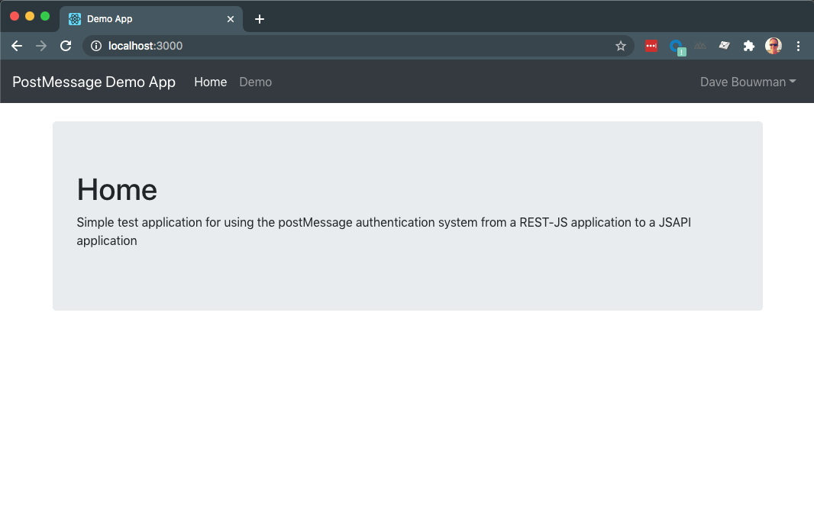
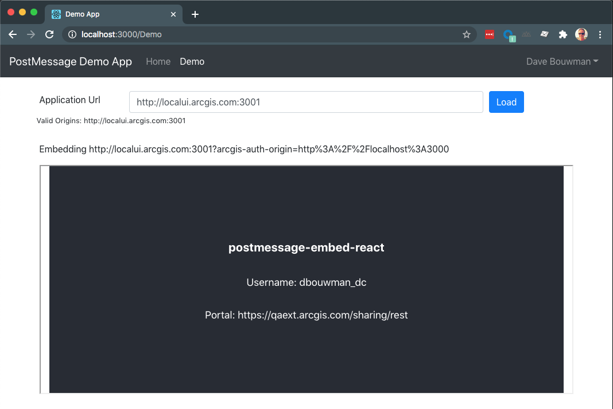

# postmessage-host-react

Simple React based demo app that acts as a host do demonstrate/test [postmessage auth](https://esri.github.io/arcgis-rest-js/api/auth/UserSession/#enablePostMessageAuth)

## How to use

By default, this will expect the embedded app to be running at `http://localui.arcgis.com:3001`. If you can't configure your app to run at that location/port, you will need to edit the `/src/routes/Demo.tsx` file and update the following lines:

```js
const defaultUrl = 'http://localui.arcgis.com:3001';
const origins = ['http://localui.arcgis.com:3001']
```

For example...
```js
const defaultUrl = 'http://some.other.url.com:8080/some/path/index.html?more=params';
const origins = ['http://some.other.url.com:8080']
```

Run the app using `yarn start`, which will open a browser at `http://localhost:3000`. 


Then click sign-in and authenticate with the platform


Once that is done you should see your username in the upper left




Then visit the Demo link in the header




This is showing a simple react app iframed in. You can download and run that app from https://github.com/dbouwman/postmessage-embed-react


## Changing Environments
The `.env` file has one setting: `REACT_APP_ENV`. This can be any of `QAEXT | DEVEXT |PROD` - by default it's set to `QAEXT`.

This value is used in the `src/config/environment.ts` file to change between registered app items/clientIds etc.

Currently the configued QAEXT item has `http://localhost:3000/redirect.html as a valid redirect.

To run in another environment, create an app, register the redirect and add the clientId into `src/config/environment.ts`


---

This project was bootstrapped with [Create React App](https://github.com/facebook/create-react-app).

## Available Scripts

In the project directory, you can run:

### `yarn start`

Runs the app in the development mode.<br />
Open [http://localhost:3000](http://localhost:3000) to view it in the browser.

The page will reload if you make edits.<br />
You will also see any lint errors in the console.

### `yarn test`

Launches the test runner in the interactive watch mode.<br />
See the section about [running tests](https://facebook.github.io/create-react-app/docs/running-tests) for more information.

### `yarn build`

Builds the app for production to the `build` folder.<br />
It correctly bundles React in production mode and optimizes the build for the best performance.

The build is minified and the filenames include the hashes.<br />
Your app is ready to be deployed!

See the section about [deployment](https://facebook.github.io/create-react-app/docs/deployment) for more information.

### `yarn eject`

**Note: this is a one-way operation. Once you `eject`, you can’t go back!**

If you aren’t satisfied with the build tool and configuration choices, you can `eject` at any time. This command will remove the single build dependency from your project.

Instead, it will copy all the configuration files and the transitive dependencies (webpack, Babel, ESLint, etc) right into your project so you have full control over them. All of the commands except `eject` will still work, but they will point to the copied scripts so you can tweak them. At this point you’re on your own.

You don’t have to ever use `eject`. The curated feature set is suitable for small and middle deployments, and you shouldn’t feel obligated to use this feature. However we understand that this tool wouldn’t be useful if you couldn’t customize it when you are ready for it.

## Learn More

You can learn more in the [Create React App documentation](https://facebook.github.io/create-react-app/docs/getting-started).

To learn React, check out the [React documentation](https://reactjs.org/).
